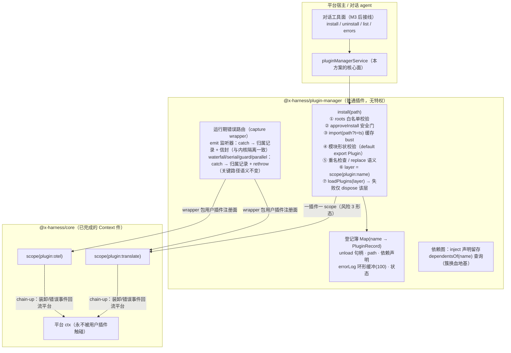

# plugin-manager 方案（对话式插件开发的装载与隔离层）

> 状态：**草稿**（待用户过目后定稿实施）
> 级别：中（新子模块 + 新外部契约 + 装卸并发语义 + 文件系统面）
> 定位：**平台上开发的第一个插件**（吃狗粮）——实现「对话开发 → 写本地文件 → 立即安装 → 失败隔离 → 错误回流对话 → 迭代重装」闭环的产品层；**不进内核**（五条判据一条不过：纯策略）。
> 依赖：仅 @x-harness/core 的 Context 件（已完成）——不需要等 session/llm/tools。

## 0. 架构总览



## 1. 契约

### 1.1 服务面（v1 全部能力；工具面是 M3 后的一行接线）

```ts
export interface PluginManagerService {
  install(input: { path: string; replace?: boolean }): Promise<Result<PluginHandle, string>>;
  uninstall(name: string): Promise<Result<undefined, string>>;
  list(): readonly PluginRecord[];
  errors(name?: string): readonly PluginErrorEntry[];
  dependentsOf(name: string): readonly string[];
}

export interface PluginHandle {
  readonly name: string;
  readonly path: string;
  unload(): Promise<Result<undefined, string>>;
}

export interface PluginRecord {
  readonly name: string;
  readonly path: string;
  readonly status: "active" | "failed";
  readonly installedAt: number;
  readonly inject: readonly string[];
}

export interface PluginErrorEntry {
  readonly plugin: string;
  readonly phase: "install" | "runtime";
  readonly where: string;        // token 名 + 模式，如 "evt-x@emit"
  readonly message: string;
  readonly ts: number;
}

export function createPluginManager(deps: {
  ctx: Context;
  roots: readonly string[];      // 安装白名单目录（防任意路径 import）
  approveInstall?: (input: { path: string; pluginName: string }) => boolean | Promise<boolean>;
  errorLogLimit?: number;        // 缺省 100
}): Plugin
```

### 1.2 错误形态与事件时序

- install 拒绝：`err(reason)`——校验/审批/重名/装载失败各自有明确 reason（英文 message）；**平台 ctx 与其他插件不受任何影响**。
- 装卸观察：内核 `plugin/loaded` 经 scope 的 chain-up 天然回流平台；产品细节（path、装载前校验失败）经 `plugin/event` 信封 `{plugin: "plugin-manager", kind: "installed" | "uninstalled" | "install-failed" | "listener-error"}`。
- 一次性时序保证：install 成功 = 句柄可用且登记完成；install 失败 = 该插件 scope 已 dispose、登记簿 status=failed、错误入 log——两个终态互斥。

## 2. 问题域

**处理**：本地模块装载（import + 缓存 bust + 形状校验）、一插件一 scope 的隔离装载、装卸生命周期登记、运行期错误归属路由（分模式：emit 吞 / waterfall 族 rethrow）、错误环形日志与查询、依赖声明留存与 dependentsOf、roots 白名单、审批挂点、replace 重装语义、装卸交错串行化（同名 install/unload 互斥——见预算）。

**不处理（写清归属）**：
- 工具注册面（install/uninstall 作为对话工具）→ M3 tools 件落地后接线（v1 服务面宿主/CLI 直接调用）；
- 标准审批流（answerer 桥）→ M3 TOOLS 件；v1 只有 approveInstall 挂点；
- 进程级硬隔离（同步崩溃/OOM/失控定时器）→ v2 的 worker 线程选项——语义隔离边界如实标注；
- 插件状态迁移 → 插件自己的责任（宿主服务范式，已有范式用例）；
- 簇换血自动编排 → dependentsOf 只供查询，编排器将来另立（§10.2 回收路径）；
- 模块级副作用清理（插件在模块顶层开的定时器）→ 装卸契约本就不覆盖，文档标注。

## 3. 并发/一致性预算

- **同名互斥**：同一插件名的 install/uninstall/reinstall 串行化（per-name promise 链）——并发同名装载不得穿透登记簿；
- 不同名并发装载：允许（各自 scope，互不影响）；
- errorLog 每插件上限（缺省 100，环形），内存有界；
- install 全程无锁等待内核（scope/loadPlugins 已是串行安全的）。

## 4. 拆分

```
packages/plugin-manager/          # @x-harness/plugin-manager（独立包，将来被 standard 策展）
  src/
    types.ts                      # 服务/记录/错误条目契约
    validate-module.ts            # 模块形状校验（default export Plugin）
    install.ts                    # 装载流程（roots/审批/import/scope/loadPlugins/登记）
    wrapper.ts                    # 错误路由 capture wrapper（分模式）
    plugin-manager.ts             # createPluginManager：组装 + 服务 provide
    index.ts
  src/__test__/
    plugin-manager.test.ts        # 单测（mock import：注入 loader 依赖便于测试）
    e2e-local-file.test.ts        # 真文件 e2e：临时目录写 TS → 装 → 隔离 → 迭代
```

依赖注入细节：`import()` 经 deps 注入（`load?: (path) => Promise<unknown>`）——单测用假 loader，e2e 用真 bun import。

## 5. 裁决（默认裁决 + 否决窗口）

1. **包位置**：独立 `@x-harness/plugin-manager`，将来 standard 策展——不进 core（判据不过）、不抢建 standard（D15 的策展包等 M4 一起立）。
2. **安全门 v1**：`roots` 白名单必填 + `approveInstall` 挂点缺省放行（信任域内本地文件）——**不是裸奔**（越界路径拒），但审批策略归宿主；M3 answerer 落地后推荐接标准审批流。可选收紧：缺省拒绝、宿主必须显式放行——**待用户拍板**。
3. **错误路由的模式分叉**：emit 监听器 catch 后不 rethrow（与内核 I3 隔离等价，但带归属）；waterfall/serial/guard/parallel 中间件 catch 后记录并 **rethrow**（关键路径 reject 语义不可吞）。
4. **replace 语义**：install 同名默认拒；`replace: true` = 先 unload（await 完成）再装——不留双版本并存的模糊态。
5. **failed 记录保留**：装载失败的记录留在登记簿（status=failed + 错误可查）直到成功重装或显式清理——对话迭代需要看见失败历史。
6. **模块形状**：`default export` 为 Plugin；named `plugin` export 作为别名宽容。

## 6. 测试口径

- **单测**（假 loader）：roots 越界拒；审批拒绝拒；形状校验四态（无 default / 非 Plugin / 缺 name / 缺 apply）拒；重名拒 + replace 成功；apply 抛错 → scope 死、平台活（平台监听者照常收到后续事件）、errors 可查；emit 监听器错误归属记录 + 信封 + 不外抛；waterfall 中间件错误归属记录 + dispatch 仍 reject；errorLog 环形上限；同名并发互斥；uninstall 后 list 状态、依赖图查询。
- **e2e**（真文件，临时目录）：写 `translate.ts`（provide 服务 + on 监听）→ install → 平台层 use 服务/emit 可见 → 改文件（行为变化）→ replace 重装 → 新行为生效；写 `broken.ts`（apply throw）→ install 失败 → 平台监听者照常工作。
- **回归锚点**：平台 ctx 在所有失败路径后仍可注册/派发（`ctx.on` 不 throw）。

## 7. 验收清单

- [ ] 九个单测场景 + 两条 e2e 全绿；平台存活断言贯穿所有失败路径
- [ ] 服务契约逐条（install/uninstall/list/errors/dependentsOf 形状与错误形态）
- [ ] 错误路由分模式语义（emit 吞 / waterfall rethrow）有直接断言
- [ ] 四门全绿 + 覆盖率 ≥90/85 + 数字如实报告
- [ ] 对抗审查（独立会话）问题清单处置清零

## 7.5 生产就绪分级（2026-09-18 补）

**v1 = dev-ready（有人在环 + WAL 兜底）**：当前方案 + 三小补——apply 超时（防 install 积压）、审批缺省收紧为拒（agent 自写自装必须人确认）、卸载前 dependentsOf 非空警告。适用：对话开发场景（人看着）、内部工具。

**v2 = unattended-production-ready**：worker 线程硬隔离（同步死循环/OOM 冻结平台事件循环——语义隔离挡不住，对话生成代码的必然风险；WAL/resume 把后果降为可用性问题而非数据安全问题，是否必须取决于 SLA）+ 错误日志持久化（审计）+ 插件 API 版本协商。

**声明级边界**：模块顶层副作用不随 unload 回收；多 agent 的层归属策略（平台层 vs agent 层）待 M3 后裁决。

## 8. 开放问题（待用户裁决）

1. 安全门缺省：信任域内（当前方案）vs 缺省全拒必须显式放行？
2. v1 是否顺带 CLI 子命令形态（`xh plugin install <path>`）——还是纯服务面等 M3 工具接线？
3. failed 记录是否需要显式 `clear(name)` API（当前方案：成功重装即覆盖）。
