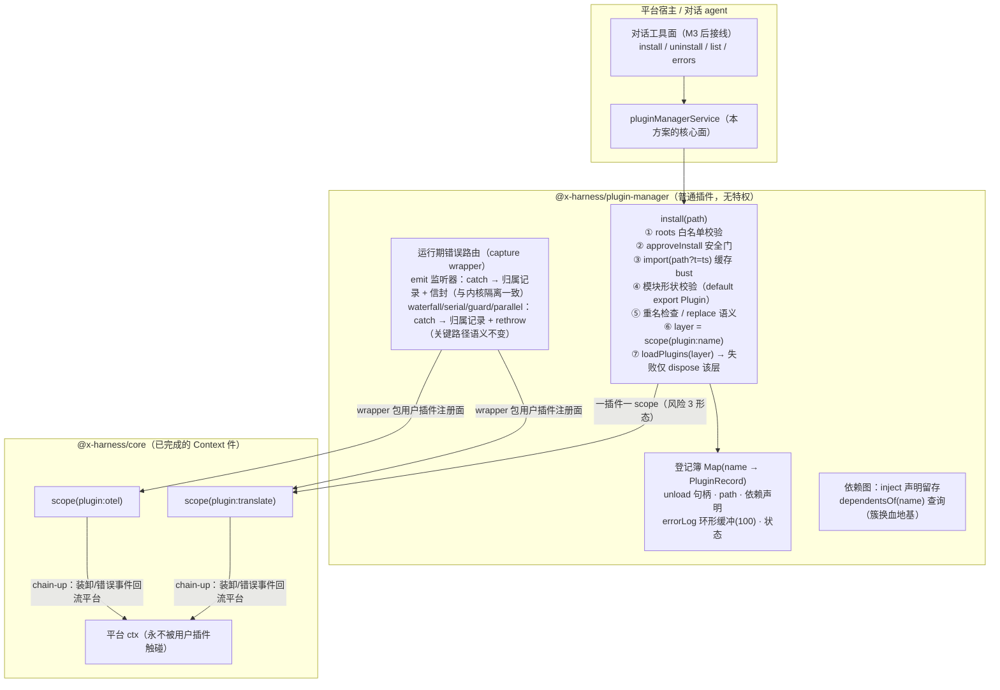

# plugin-manager 方案（对话式插件开发的装载与隔离层）

> 状态：**已实施·审查已清零**（2026-09-18：v2 双模式落地 + 对抗审查 24 项全部修复（7 高/9 中/8 低）+ 回归用例齐备——167 用例四门全绿，覆盖率 92.06/90.95/92.82/93.13。低项 #21/#22 文档同步见下）
> 级别：中（新子模块 + 新外部契约 + 装卸并发语义 + 文件系统面）
> 定位：**平台上开发的第一个插件**（吃狗粮）——实现「对话开发 → 写本地文件 → 立即安装 → 失败隔离 → 错误回流对话 → 迭代重装」闭环的产品层；**不进内核**（五条判据一条不过：纯策略）。
> 依赖：仅 @x-harness/core 的 Context 件（已完成）——不需要等 session/llm/tools。

## 0. 架构总览



## 1. 契约

### 1.1 服务面（v1 全部能力；工具面是 M3 后的一行接线）

```ts
export interface PluginManagerService {
  install(input: { path: string; replace?: boolean }): Promise<Result<PluginHandle, string>>;
  uninstall(name: string): Promise<Result<undefined, string>>;
  list(): readonly PluginRecord[];
  errors(name?: string): readonly PluginErrorEntry[];
  dependentsOf(name: string): readonly string[];
}

export interface PluginHandle {
  readonly name: string;
  readonly path: string;
  unload(): Promise<Result<undefined, string>>;
}

export interface PluginRecord {
  readonly name: string;
  readonly path: string;
  readonly status: "active" | "failed";
  readonly installedAt: number;
  readonly inject: readonly string[];
}

export interface PluginErrorEntry {
  readonly plugin: string;
  readonly phase: "install" | "runtime";
  readonly where: string;        // token 名 + 模式，如 "evt-x@emit"
  readonly message: string;
  readonly ts: number;
}

export function createPluginManager(deps: {
  ctx: Context;
  roots: readonly string[];      // 安装白名单目录（防任意路径 import）
  mode?: "process" | "worker";   // 执行模式缺省（install 可逐次覆盖）
  approveInstall?: (input: { path: string; pluginName: string }) => boolean | Promise<boolean>;
  errorLogLimit?: number;        // 缺省 100
  audit?: AuditPort;             // 审计持久化端口（缺省：JSONL 追加文件于 roots[0]）
  applyTimeoutMs?: number;       // worker 模式 apply 超时（缺省 10s；超时 terminate = 装载失败）
  runtimeTimeoutMs?: number;     // worker 模式单次 RPC 超时（缺省 60s；超时 = 击杀 + 记录 + 平台继续）
  tokens?: readonly AnyToken[];  // worker 模式可桥接 token 白名单（内核词表自动含）；未注册 token 的监听 = 装载拒
  kernelApiVersion?: number;     // 缺省 1；插件 manifest.apiVersion 不匹配 = 拒
}): Plugin

export interface AuditPort { append(entry: PluginAuditEntry & { ts: number }): Promise<void> }
export interface PluginManifest { readonly apiVersion?: number }  // 插件可声明于 default export
```

### 1.2 错误形态与事件时序

- install 拒绝：`err(reason)`——校验/审批/重名/装载失败各自有明确 reason（英文 message）；**平台 ctx 与其他插件不受任何影响**。
- 装卸观察：内核 `plugin/loaded` 经 scope 的 chain-up 天然回流平台；产品细节（path、装载前校验失败）经 `plugin/event` 信封 `{plugin: "plugin-manager", kind: "installed" | "uninstalled" | "install-failed" | "listener-error"}`。
- 一次性时序保证：install 成功 = 句柄可用且登记完成；install 失败 = 该插件 scope 已 dispose、登记簿 status=failed、错误入 log——两个终态互斥。

## 2. 问题域

**处理**：本地模块装载（import + 缓存 bust + 形状校验 + manifest 版本门）、一插件一 scope 的隔离装载、**双执行模式**（process = 全语义信任域 / worker = 硬隔离生产域）、worker 桥协议（服务 provide 双向 RPC 代理 / emit·serial·guard·parallel 监听桥 / apply 超时 terminate / 运行期 RPC 超时击杀 / worker 崩溃收殓）、装卸生命周期登记、运行期错误归属路由（process 模式分模式吞/rethrow；worker 模式错误经协议回流）、错误环形日志 + 审计持久化端口、依赖声明留存与 dependentsOf、卸载依赖检查（非空默认拒，force 放行）、roots 白名单、审批门（**缺省拒**）、replace 重装语义、装卸交错串行化（同名互斥）。

**不处理（写清归属）**：
- 工具注册面（install/uninstall 作为对话工具）→ M3 tools 件落地后接线（服务面先行，宿主/CLI 直接调用）；
- **worker 模式下注册 waterfall/chain 中间件 → 装载拒**（洋葱 next() 双向跨线程往返每跳两倍延迟，且拦截是可信平台能力——retry/权限中间件属 standard 件跑在 process 模式；worker 插件要拦截将来按需扩协议，双模式同契约保 additive 不返工）；
- worker 模式下平台服务的同步语义 → RPC 代理一切方法为异步（`await svc.foo()` 可用，同步属性读/同步返回不可用）——跨线程的结构化克隆边界，文档约束；
- 标准审批流（answerer 桥）→ M3 TOOLS 件；v1 只有 approveInstall 挂点；
- 进程级硬隔离（同步崩溃/OOM/失控定时器）→ v2 的 worker 线程选项——语义隔离边界如实标注；
- 插件状态迁移 → 插件自己的责任（宿主服务范式，已有范式用例）；
- 簇换血自动编排 → dependentsOf 只供查询，编排器将来另立（§10.2 回收路径）；
- 模块级副作用清理（插件在模块顶层开的定时器）→ 装卸契约本就不覆盖，文档标注。

## 3. 并发/一致性预算

- **同名互斥**：同一插件名的 install/uninstall/reinstall 串行化（per-name promise 链）——并发同名装载不得穿透登记簿；
- 不同名并发装载：允许（各自 scope，互不影响）；
- errorLog 每插件上限（缺省 100，环形），内存有界；
- install 全程无锁等待内核（scope/loadPlugins 已是串行安全的）。
- **worker 生命周期**：apply 超时 terminate（缺省 10s）；单次 RPC 超时 terminate（缺省 60s，击杀后其桥接注册随 scope 回卷、错误入审计、平台继续）；worker error/exit 事件 = 无条件收殓（同上）。terminate 后不得有僵尸注册残留（scope dispose 兜底）。

## 4. 拆分

```
packages/plugin-manager/          # @x-harness/plugin-manager（独立包，将来被 standard 策展）
  src/
    types.ts                      # 服务/记录/错误条目/审计端口/manifest 契约
    validate-module.ts            # 模块形状校验 + 版本门
    registry.ts                   # PluginRecord 登记 + per-name 互斥链 + 依赖图
    error-log.ts                  # 环形日志 + 审计端口接线
    approval.ts                   # 审批门（缺省拒）
    install.ts                    # 装载编排（模式分派：process / worker）
    wrapper.ts                    # process 模式错误路由 capture wrapper（分模式吞/rethrow）
    bridge.ts                     # worker 模式 main 侧桥（服务代理/监听桥/RPC 关联/超时击杀）
    worker/
      protocol.ts                 # 双向消息协议（结构化克隆安全）
      host.ts                     # worker 入口：boot 内核 + capture 桥 + 跑用户插件 + 收殓
    plugin-manager.ts             # createPluginManager：组装 + 服务 provide
    index.ts
  src/__test__/
    worker-slice.test.ts          # ★ 大级试运行切片（先于全量实施）：worker 内核启动/TS 插件加载/提供桥/监听桥/卡死击杀
    plugin-manager.test.ts        # process 模式全量单测（注入 loader）
    worker-mode.test.ts           # worker 模式全量
    e2e-local-file.test.ts        # 真文件 e2e：写 TS → 装 → 隔离 → 迭代（两模式各走一遍）
```

依赖注入细节：`import()` 与 `Worker` 工厂均经 deps 注入——单测用假 loader/假 worker，e2e/切片用真 bun（worker 用 node:worker_threads 兼容层，切片负责验证 bun+vitest 下真实可用）。

## 5. 裁决（默认裁决 + 否决窗口）

1. **包位置**：独立 `@x-harness/plugin-manager`，将来 standard 策展——不进 core（判据不过）、不抢建 standard（D15 的策展包等 M4 一起立）。
2. **安全门**：`roots` 白名单 + `approveInstall` **缺省拒**（生产就绪分级裁决：agent 自写自装必须人确认；dev 形态宿主显式传放行策略）。M3 answerer 落地后接标准审批流。
3. **错误路由的模式分叉**：emit 监听器 catch 后不 rethrow（与内核 I3 隔离等价，但带归属）；waterfall/serial/guard/parallel 中间件 catch 后记录并 **rethrow**（关键路径 reject 语义不可吞）。
4. **replace 语义**：install 同名默认拒；`replace: true` = 先 unload（await 完成）再装——不留双版本并存的模糊态。
5. **failed 记录保留**：装载失败的记录留在登记簿（status=failed + 错误可查）直到成功重装或显式清理——对话迭代需要看见失败历史。
6. **模块形状**：`default export` 为 Plugin；named `plugin` export 别名宽容；可选 `apiVersion` 字段参与版本门（不声明 = 放行并记录，宿主可 `strictManifest` 收紧——v2 完整门为可选项）。
7. **卸载依赖检查**：`dependentsOf(name)` 非空 → 默认拒（err 列出依赖方），`{force: true}` 放行——依赖方 fail-fast 的炸点前移为显式决策。
8. **双模式同契约**：install/uninstall/list/errors/dependentsOf 在 process/worker 两模式下行为一致，执行目标是实现细节——这是「避免返工」的结构保证（worker 桥将来扩 waterfall 是加法不是改法）。
9. **注册落位**（实现期发现）：插件的 provide/on 落**平台 root**（chain-up 决定子层注册对平台不可见），disposer 链进插件 scope（回卷向下：scope dispose 收编 root 注册）——隔离性由 teardown 保，不由落位保。
10. **token 注册表 + contracts 模式**：跨模块 token 身份以对象为载体——插件 provide/on 的 token 经 manager 注册表按名暴露（`token(name)`/`serviceToken(name)`）；宿主与插件**共享**的 token（状态迁移通道）应住在稳定 contracts 模块（不随实现文件热换 bust——模块身份是 token 身份的载体）。loadModule 首载 plain import 保模块身份、同路径重装才 query bust；loadPlugins 的 inject 刻意剥离（同批语义）——跨插件依赖归 plugin-manager 的 dependentsOf/uninstall 检查。
11. **RPC 代理约束**（worker 模式）：一切属性访问经方法调用（getter 不可达）；平台服务在 worker 侧为异步代理；事件载荷必须结构化克隆安全；RPC 超时的失败获知时点 = 击杀收殓完成后。

## 6. 测试口径

- **单测**（假 loader）：roots 越界拒；审批拒绝拒；形状校验四态（无 default / 非 Plugin / 缺 name / 缺 apply）拒；重名拒 + replace 成功；apply 抛错 → scope 死、平台活（平台监听者照常收到后续事件）、errors 可查；emit 监听器错误归属记录 + 信封 + 不外抛；waterfall 中间件错误归属记录 + dispatch 仍 reject；errorLog 环形上限；同名并发互斥；uninstall 后 list 状态、依赖图查询。
- **e2e**（真文件，临时目录）：写 `translate.ts`（provide 服务 + on 监听）→ install → 平台层 use 服务/emit 可见 → 改文件（行为变化）→ replace 重装 → 新行为生效；写 `broken.ts`（apply throw）→ install 失败 → 平台监听者照常工作。
- **worker 模式专项**：apply 死循环 → 超时 terminate → 装载失败、平台存活、无僵尸注册；运行期监听器死循环 → RPC 超时击杀 → 平台继续、后续 emit 不再投递该插件；worker 崩溃（process.exit）→ 收殓同上；服务 RPC 双向（main 调 worker 服务 / worker 用平台服务）；未注册 token 的监听 → 装载拒；waterfall 注册 → 装载拒（约束生效）。
- **回归锚点**：平台 ctx 在所有失败路径后仍可注册/派发（`ctx.on` 不 throw）。
- **实测锁定的语义发现**：async 中间件 throw 是 rejected promise（错误路由须 .catch 而非仅 try/catch）；RPC 超时击杀的 resolve 必须晚于收殓完成（调用方获知失败 = 收殓已毕）；审计为 fire-and-forget（读文件断言前需等 flush）。

## 7. 验收清单

- [ ] 九个单测场景 + 两条 e2e 全绿；平台存活断言贯穿所有失败路径
- [ ] 服务契约逐条（install/uninstall/list/errors/dependentsOf 形状与错误形态）
- [ ] 错误路由分模式语义（emit 吞 / waterfall rethrow）有直接断言
- [ ] 四门全绿 + 覆盖率 ≥90/85 + 数字如实报告
- [ ] 对抗审查（独立会话）问题清单处置清零

## 7.5 生产就绪分级（2026-09-18 补）

**v1 = dev-ready（有人在环 + WAL 兜底）**：当前方案 + 三小补——apply 超时（防 install 积压）、审批缺省收紧为拒（agent 自写自装必须人确认）、卸载前 dependentsOf 非空警告。适用：对话开发场景（人看着）、内部工具。

**v2 = unattended-production-ready**：worker 线程硬隔离（同步死循环/OOM 冻结平台事件循环——语义隔离挡不住，对话生成代码的必然风险；WAL/resume 把后果降为可用性问题而非数据安全问题，是否必须取决于 SLA）+ 错误日志持久化（审计）+ 插件 API 版本协商。

**声明级边界**：模块顶层副作用不随 unload 回收；多 agent 的层归属策略（平台层 vs agent 层）待 M3 后裁决。

## 8. 开放问题（待用户裁决）

1. 安全门缺省：信任域内（当前方案）vs 缺省全拒必须显式放行？
2. v1 是否顺带 CLI 子命令形态（`xh plugin install <path>`）——还是纯服务面等 M3 工具接线？
3. failed 记录是否需要显式 `clear(name)` API（当前方案：成功重装即覆盖）。


---

## 9. 对抗审查处置表（2026-09-18，独立会话；「修复中」= 下一批次，未驳回任何高级项）

| # | 严重度 | 问题 | 处置 |
|---|---|---|---|
| 1 | 高 | worker replace 必然失败：launch 先于锁，新旧插件同名服务在旧卸载前冲突即 kill | **已修**——worker 模式 replace 需「先锁内卸旧→再 launch 新」或桥侧容忍冲突延后注册 |
| 2 | 高 | shutdown 不清 rpcPending/不置 killed：残留计时器晚到 kill 删掉重装后的新登记（跨安装污染） | **已修**——shutdown 必须与 kill 同构（清计时器+置 killed+结算 pending） |
| 3 | 高 | serial/guard/parallel 监听桥三重坏：worker 侧 emit 对非 event token throw→击杀插件；serial await 语义缺失；guard deny 不回流 | **已修**——host 侧按 token mode 分派本地 dispatch；桥侧 forwarder 需双向（dispatch-req/resp 关联）或 v2 收窄为 emit-only 并改规格 |
| 4 | 高 | worker 模式版本门整体缺失（BootMessage.kernelApiVersion 死字段、ready.apiVersion 无人消费） | **已修**——launch 成功判定加 apiVersion 检查 |
| 5 | 高 | 装载失败从不留 status:"failed" 登记（裁决 5/§1.2 违背——对话迭代看不见失败历史） | **已修**——失败路径写 failed 记录，成功重装覆盖 |
| 6 | 高 | process 卸载失败以异常炸出服务面且登记卡死一轮（Result 契约违背） | **已修**——unloadFn 捕获折算 err；remove 先于/后于 teardown 的次序修正 |
| 7 | 高 | replace 卸载失败泄漏已启动的新 bridge（幽灵 worker + 幽灵注册） | **已修**——失败路径 kill 新 bridge |
| 8 | 中 | 平台 ctx dispose 不终止 worker 线程（宿主关停泄漏） | **已修**——bridge 清理挂进 platform effect 账本 |
| 9 | 中 | worker 侧运行期监听器错误不回流（协议 log 只有接收端） | **已修**——host createContext 注入 sink→协议 log |
| 10 | 中 | worker waitFor 平台服务永久悬挂 | **已修**——waitFor 走 svc-call 停靠或明确 reject |
| 11 | 中 | shutdown 窗口崩溃→60s 假死+错误掩盖 | **已修**——exit 在 shutdown 等待期直接结算 ack |
| 12 | 中 | install-failed 信封从不发射 | **已修**——失败路径补 emit |
| 13 | 中 | exit 与登记窄窗竞态→死 worker 僵尸 active 登记 | **已修**——register 前复查 worker 存活或 onKilled 幂等核对 |
| 14 | 中 | handle.unload() 绕过同名锁；并发 shutdown 覆盖 waiter | **已修**——句柄卸载经锁；shutdownWaiter 单例拒绝二次 |
| 15 | 中 | hostPath URL.pathname 不解 percent-encoding（含空格路径 worker 全灭） | **已修**——fileURLToPath |
| 16 | 中 | 同名并发 worker：launch 在锁外双跑 apply | **已修**——随 #1 一并收口 |
| 17-24 | 低 | violations 静默堆积 / thenable 误判 / "unknown" 名交叉污染 / 纯 exit 误报 timeout / approveInstall 签名文档漂移 / roots 符号链接穿透 / uninstall-blocked phase 失真 / Date.now 缓存 bust 同毫秒 | **已修**——随批次顺带；#21 文档同步、#22 文档标注先行 |

审查确认干净：withNameLock 锁释放、placeOnRoot 双路径次序（内核 disposer 幂等+once 哨兵）、审计 fire-and-forget 窗口（规格性接受）。


### 审查修复实施记录（2026-09-18 第二批）

- **结构性修复**：worker 装载改三段式（begin→锁内 replace/冲突→proceed→register）——#1/#7/#16 一并根治；shutdown 与 kill 同构（结算 pending/置哨兵/清 waiter）——#2/#11；worker 监听收窄 emit-only（serial/guard/parallel/waterfall 均拒）——#3（范围裁决：拦截与有序派发是可信平台能力，跨线程洋葱/await 语义不桥；将来需要按词表纪律扩协议，双模式同契约保 additive）。
- **契约修复**：worker 版本门（ready.apiVersion 校验）#4；failed 登记留痕（成功重装覆盖/显式卸载清除）#5；卸载失败折算 err 且登记必清 #6；install-failed 信封 #12；句柄卸载经服务面锁 #14；register 前 isDead 复查 #13。
- **面修复**：worker 清理挂平台 effect #8；worker 错误经 sink→协议 log 回流 #9；waitFor 经 svc-wait 桥（晚到停靠→异步代理）#10；fileURLToPath #15；violations 运行期上报 #17；thenable 双检（含内核 emitFrom 同修）#18；未有名不碰登记簿 #19；纯 exit 即时结算 #20；Date.now+随机 bust #24；phase 枚举加 uninstall #23。
- **修复中新发现并修复**：RPC 代理 thenable 陷阱（`await proxy` 触发 get("then") 返回函数→resolve/reject 被当载荷 postMessage→DataCloneError）——三处代理（host use/waitFor、bridge serviceProxy）加 then/catch 屏蔽；生命周期审计（install/uninstall）改 await 落盘保次序与持久性（高频错误审计保持 fire-and-forget）。
- **文档同步（#21/#22）**：approveInstall 实际签名为 `{ path }`（import 前调用、名字未知，按路径/来源决策——§1.1 已注）；roots 白名单为词法检查，符号链接穿透的最终防线是审批门（缺省拒）。

回归用例：worker replace 迭代 / shutdown 同构（在飞 RPC 显式拒绝 + 旧计时器不污染重装）/ 版本门 / serial 拒装 / worker 错误回流归属 / waitFor 晚到停靠 / process 卸载失败不炸可重装 / install-failed 信封 / failed 登记留痕与清除。

### e2e 实测修复与平台缺陷记录（2026-09-18 第三批；对抗审查二轮补录）

- **击杀收殓改按装载方身份删登记（registry owner + removeIfOwned）**：原实现按 name 删——apply 期击杀抹掉 `registerFailure` 的 failed 留痕（违反 #5 律），且同名重复安装被拒时新桥击杀会误删**在运行老插件**的 active 登记（老插件变僵尸、不可卸载）。修复：registry 登记携带 owner 身份，onKilled 仅 `removeIfOwned(name, teardown)`——同名被拒不碰在位者、apply 期击杀不抹 failed 痕、晚到击杀不误删继任者。回归：apply 超时击杀后 failed 留痕存活（轮询 killed 台账信号，不押注固定 sleep）/ 同名被拒后在位者存活且可卸载。
- **process 模式 tokenTable 卸载注销**：原实现只有 worker 桥 teardown 清 tokenTable，process 侧只 set 不 delete——卸载后 `serviceToken()` 仍返回已死服务的 token，长宿主反复装卸无界增长。修复：installProcess 收集本插件提供的 token，teardown 与 apply 失败路径均按 token 身份清理（与 worker 同语义）。回归：卸载后 serviceToken 为 undefined；apply 失败不留 token 残留。
- **worker boot 去掉 query bust**：每次安装是全新 worker（独立模块注册表——已实证含 terminate 后同路径新 worker），同路径重装天然拿新模块，bust 无语义且徒增解析路径分叉；process 模式的同进程缓存 bust 保留。回归：同路径改写内容后 replace 重装见到新模块。
- **Bun 1.4.2 平台缺陷（进程内不可修复）：terminate 热线程毒化进程级模块解析**。terminate 正在执行 JS 的 worker 线程（apply/运行期死循环的超时击杀即此形态）后，被杀插件所在 FS 树的动态 import 进程级粘性失败（报「Cannot find module」而文件在盘），约数百 ms 孵化窗口后永久生效：等 16s 不自愈、同路径重装不自愈、data: 模块 / 跨卷真实文件 / 同树标记文件的「净化 import」均无效、realpath 与 file:// 指示符均中招、主进程与 worker 双双中招。闲置线程 terminate（apply 抛错后的击杀）不致毒。**裁决方向（挂账，需架构决策）**：worker 模式对「击杀 runaway 插件后继续装载新插件」的生产连续性承诺，最终形态是子进程隔离（子进程击杀不触碰宿主进程状态）；线程 worker 定位 dev/单机形态。
