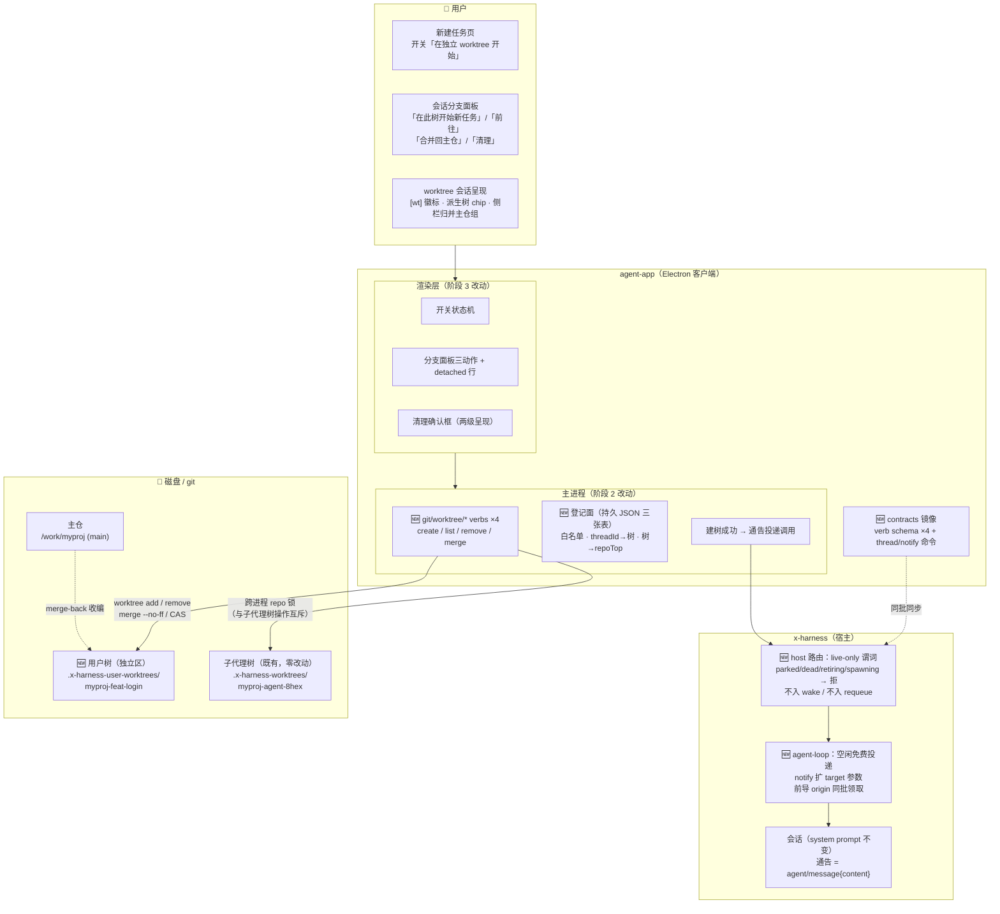
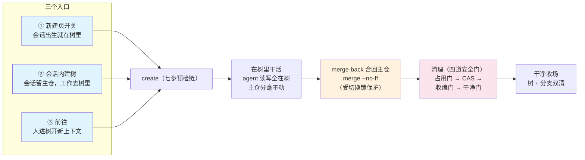
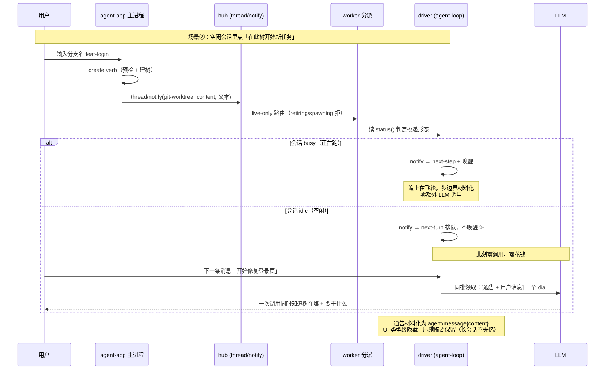
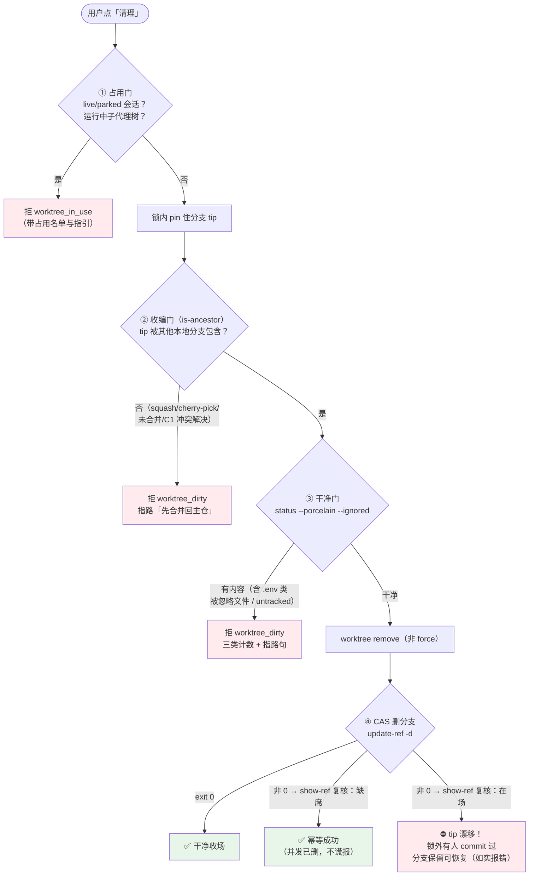
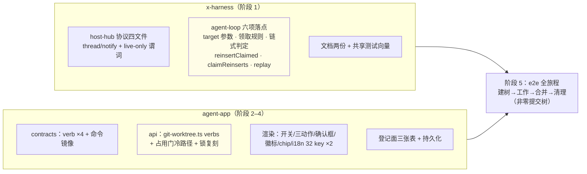

# 会话级 Worktree 工作流——架构图解

> 配套文档：SESSION-WORKTREE-WORKFLOW.md（v5.0 定稿）。本文件用图回答三个问题：**给用户添了什么、两仓各改了什么、数据怎么安全地流动**。

## 1. 总架构：两仓五层全景

**读图要点**：蓝框 🆕 是本方案新增；子代理树区（agent-delegation 包）**产品代码零改动**——本方案与既有委派机制完全正交，只共享 git 层的跨进程锁。

## 2. 用户旅程：三个入口 + 完整生命周期

**生命周期间 = 出生 → 收编 → 销毁**，全程 GUI 内闭环。没有 merge-back 的话，清理门要求"已收编"而用户无路可走——树越有价值越删不掉（二轮产品审查判阻断后补上的关键一环）。

## 3. 核心新能力：空闲会话的免费通告（为什么动 agent-loop）

**对比（若无此能力）**：现状 `notify` 恒唤醒 → 空闲会话被叫醒 → 一轮只有通告的完整 LLM 调用（花钱 + 模型回一句没人要的"知道了"永久留在对话里）。配套改动三处缺一不可：target 选队列、**前导 origin 同批领取**（否则通告独占首轮、用户消息被挤到下一轮）、**仅剩 origin 不链式**（否则收尾后又拉起纯通告轮）。

## 4. 数据安全：清理的四道门 + CAS

**CAS 是全方案数据安全的最后防线**：agent 的 bash commit 完全在跨进程锁之外（锁只互斥树管理操作）——门评估后若有穿插 commit，普通 `branch -D` 会无检查恒删，CAS 因 tip 不匹配必然失败，分支与提交保留可恢复。判别链（exit 两态 + show-ref 复核）不依赖 stderr 文案与版本敏感码值。

## 5. 改动清单速览（给评审/排期）

**改动边界承诺**：agent-delegation 包产品代码零改动（子代理域与用户域完全正交）；无旧路径删除、无兼容层、无双轨字段；agent-loop 改动全部纯加法（target 参数带缺省，现有消费方零感知）。

## 6. 红线（为什么这样设计）

| 红线 | 对设计的约束 |
| --- | --- |
| KV 缓存前缀不可变 | system prompt 装配期铸死；一切动态事实走 agent/message 追加（通告不碰缓存前缀） |
| 会话 cwd 是出生事实 | 不做会话中途换 cwd；「会话去树里」= 前往开新会话 |
| 用户树永不自动清理 | 与子代理树（会话结束自动评估）物理分区 + 判据分治；清理只能显式过四道门 |
| 零兼容层 | 纯加法；删分支单轨 CAS（branch -D 彻底退役） |
